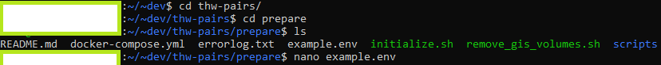
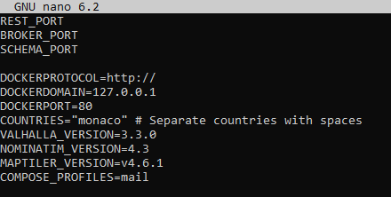
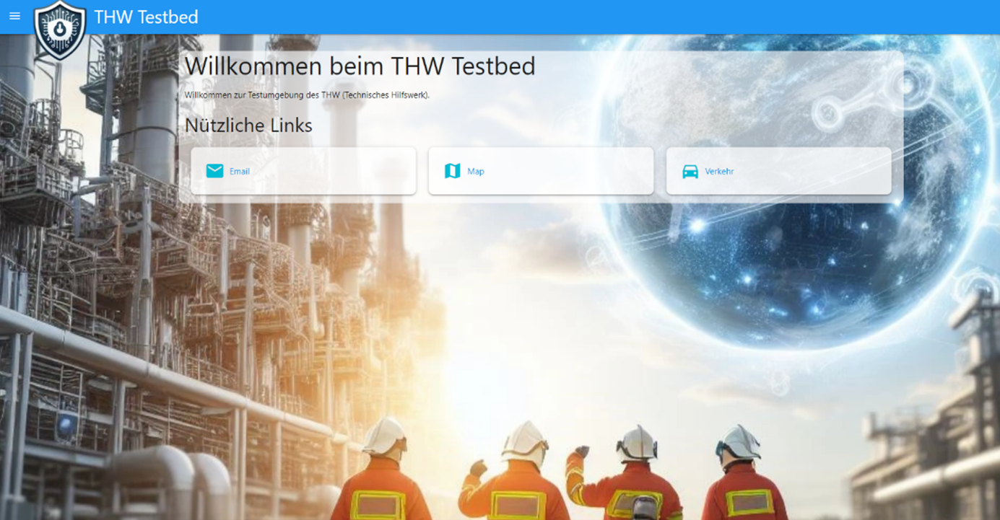

# Documentation Pairs-adjusted TMT

> Last updated: 26.03.2
> Author: Tobias Spanke
> 
> All software is openly available and free to use/adjust under the MIT license
> 
> [Repository link (https://github.com/erikvullings/thw-pairs)](https://github.com/erikvullings/thw-pairs)
> 
> See Appendix (4.0) for additional step-by-step advice or get the [Word docx](./PAIRS-TMT_Documentation_v7_Final.docx).

## 1. Base requirements

-   **Router:** Local (open) network with access to Router. Preferably network with internet connection. Option to disable firewall helpful
-   **Host server:** Laptop/PC where the TMT is running. Participants access this machine, so network must be open for clients to see each other. At least 16GB of RAM recommended
-   **Docker:** Host server needs installation of Docker for TMT installation
-   **Linux:** Host server needs Linux (on Windows machines Ubuntu WSL is best due to kernel integration with Windows Docker) to adjust various aspects of TMT
-   **User laptops:** PC/Laptops for participants to access TMT services via web browser (Chrome preferred)

## 2. TMT installation:

### 2.1 Prerequisites

-   Install Linux (Ubuntu WSL on Windows machine) on host server. Ubuntu WSL can be downloaded and installed directly within the Microsoft Store
-   Install Docker in Windows on the host server. [Setup manual and download: https://docs.docker.com/desktop/install/windows-install](https://docs.docker.com/desktop/install/windows-install)

-   Enable Linux integration for WSL in Docker settings
    -   Copy TMT PAIRS repo from GitHub to the Linux distribution using command line argument: `git clone https://github.com/erikvullings/thw-pairs.git`

### 2.2 Prepare map service in the Linux distribution:

-   Edit the `example.env` (`nano example.env` in Linux) file in the prepare folder depending on the countries that should be downloaded for the map service. RAM limits on host server might occur, 16GB sufficient for Belgium + Germany + Switzerland. Tests setup should be done using only \"Monaco\". See Appendix
-   Edit the `DOCKERDOMAIN` address to the IP of the host PC in the `example.env` file for participants to access the map service
-   Save the `example.env` file as `.env` in the prepare folder using the following command in Linux:

```bash
cp example.env .env
```

-   Run the following commands in the prepare folder to update Linux apps, enable shell execution rights and install the maps service (this will take a while):

```bash
sudo apt-get update
sudo apt-get install -y parallel
chmod a+x \*.sh
./initialize.sh
```

-   Repeat the process of editing and copying the example.env for the example.env file in the docker folder

```bash
cd thw-pairs/docker
```

### 2.3 Docker container:

-   Run docker compose pull in docker folder to download TMT services
-   then docker compose up -d to create docker containers directly into Windows Docker
-   After Docker shows the containers running, check [http://localhost] to access the TMT start page. You should see something similar to Figure 1.

## 3 TMT setup

The Driver+ version of the TMT has a documentation with helpful advice also relevant for the PAIRS TMT version available under: "Book Chapter Erik Vullings"

The PAIRS TMT has five main capabilities that were used for the PAIRS table top scenario or that can be used in future scenarios (see also the [animation] or other [DRIVER+ documentation]):

1.  A **scenario editor**, for creating and executing scenarios during a training or trial ([source code]).
2.  The **time service** that keeps track of the duration of the trial, including a billboard to display messages, notifications and videos ([source code][1]).
3.  An **email service** that lets participants of the trial communicate. Messages are sent without the need for an internet connection over the server running the TMT, thus secure and only available within the tabletop context ([source code][2]).
4.  A **map service** that displays the downloaded maps with several options to overlay information. These include tactical signs used by first responders and functions to mark areas of interest (simple version of a digital situation map, [source code][3]).
5.  An offline **logistics service** that routes vehicles or people along predefined routes. Two modes exist that allow trial leaders and participants to retrieve different information during the trial in order to incorporate the request and dispatch of goods in a scenario.

-   The scenario editor is the place in the TMT where general information about the trial is predefined. Participants can be setup to attach mail addresses to them. A timeline for the trial can be created or messages for the billboard can be prepared. The editor is accessed via the context menu (three lines upper left corner) of the TMT start page ([http://localhost]) by clicking on Scenario editor and then (1) creating a scenario (green + symbol) and (2) clicking on the created scenario. Detailed information can be found in the [DRIVER+ Reference implementation] or [Introduction - Test-bed specification (gitbook.io)].
-   The time service is a function that displays the current real time (and, if set, tabletop simulation time) with the possibility to send various messages (text, videos or audio) that are overlayed onto the time. It can be accessed via localhost/time/ or the context menu (upper left) in the TMT start page. Messages are sent via the TMT scenario editor (context menu) by clicking on your scenario and then adding an inject to the main story line (+ symbol). In the dropdown menu, select Send billboard or video message and send the message to the time service with the SEND MESSAGE button.
-   The email service is a copy of the known [roundcube email client] that lets trial participants communicate in a simple manner. Mail addresses are setup by adding participants and their email address to the scenario:
    1.  Open TMT scenario editor and click on your scenario
    2.  Click on the cogwheel in the upper right
    3.  Add specific users (participants) with the green button and assign them an email address. The login password is \"default\".
    4.  To enable the address, send an email from the scenario editor to all mal addresses of the participants: Navigate to your main storyline, add an inject (+ symbol) and select Send email in the dropdown menu
    5.  Fill out the form and send the email via the SEND MESSAGE button.
    6.  Now participants can login using the Email button on the frontpage of the TMT webpage (localhost/webmail, password=default)
-   The maps service allows participants to create a simplified digital situational map. Areas on a map can be marked using a polygon tool and metadata can be attached to those marked areas. Additionally, a set of tactical signs used in German first responder units was added that can also be placed on the map. Participants of a trial can access the same map and add information to it. The available map depends on the setup process described under 2.2.
    -   Participants open the map from the start page of the TMT
    -   First, a new layer needs to be placed over the map by a participant via the layer symbol in the top right corner. The Legend tab shows all existing `Tactical signs` and `Additional symbols`, a new layer is created via the NEW LAYER tab and by clicking CREATE
    -   The process for `tactical signs and area markings` is described in the following. Additional useful pictograms via the `Additional symbols` layer are created analogous:
    -   Tactical signs and area markings are placed using the left-hand menu (line tool, polygon tool, marker tool) in the maps interface. One mouse click places a point from which the mouse can be dragged to create an area. A selection is finished with a double mouse click (lines turn blue from orange)
    -   In the opening menu on the right, metadata can be added and the colour of the selection may be adjusted
    -   One click on a selection brings up the metadata menu and the selection (polygon) can be deleted

    Tactical signs can be placed with a mouse click using the Marker tool (pin symbol) in the left menu. In the opening menu on the right, symbols from the THW tactical signs catalogue can be chosen.

-   The logistics service of the PAIRS TMT offers the functionality of routing applications but with specific adaptations in the framework of the TMT. With this service, scenarios can incorporate logistical aspects like requests and dispatch of goods that are shipped via land. In the context of disaster relief, the transport of good by first responders or the request of material to disaster sites can be a crucial aspect for disaster relief scenarios. Adaptations of the service include offline availability, separated GUIs for trial leaders and participants, routing of objects (cars, trucks, people) along predefined routes and the capability for trial leaders to start/stop the routing service for more flexibility during a trial (e.g. simulating road blockage).
-   The service is accessed via the start page of the TMT by clicking on "Logistik". The main window showing the map is now different for trial leaders and participants. When starting the TMT, it shows the window for the trial leader including the option to send a vehicle to a defined place (white box).
-   Trial leaders can access the information tab (i-symbol) in the top right corner to select whether a computer (used by participants in tabletop scenario) should be a participant or leader and select the language (ENG/GER).
-   Trial leaders can also access the cogwheel in the top right corner. This is the section of the service to define all vehicles and locations to/from which vehicles can drive. It is also possible to add vehicles and locations on-the-go during a trial to e.g. respond dynamically to a tabletop scenario.
-   **EXAMPLE:** A requests for a shipment of sandbags to a flooding area could reach a staff room (participants) via mail. The participants task may include to contact the responsible unit at a warehouse to pack and deliver the sand bags to a specific place. The warehouse then returns the information via mail that the truck left the warehouse. Participants should then follow the truck using the routing service to stay up-to-date while providing information on e.g. ETA and amount of sandbags to responsible personnel in the flooding area.
    -   The example shows that the trial leader(s) can interactively setup or direct the course of events and prepare routes that might be relevant in the scenario. To setup vehicles and places, the cogwheel in the top right corner of the logistics service is used.
    -   PLACES and VEHICLES can be added by filling out information such as the "Name" (e.g. THW incident Berlin), "Type" and the description (e.g. Demonstration Town Hall Berlin). Important: Latitude and Longitude are required to position the place on the maps and can be easily added using the integrated map in the settings menu. By clicking the plus sign next to "PLACES", the location is added to the maps and the process can be repeated.
    -   Note: Places with the Type "Place" are not shown with a permanent symbol on the map. If for some reason a location should be visible during a trial, like e.g. a warehouse, the type "Warehouse" can be used and a symbol is then shown on the map. Custom symbols can be added manually via the icon selector or uploaded (jpg, png, etc)
-   Routes for vehicles occur from place to place, so at least two need to be predefined. They are added similarly to places, with the addition that a START point for this vehicles is required (chosen from the predefined places). Trial leaders can add a description to vehicles in the description field. Tables in Markdown script can be pasted in the description field and this table is shown when clicking on a vehicle on the maps layer (home symbol, top right corner).
-   If places and vehicles are added, clicking the "play" button in the top right corner of the settings menu activates the routing service.
-   To send vehicles from one place to another, trial leaders go to the home screen, select a vehicle and its destination and press the "play" button, which starts the routing.
-   Regular participants see on their version of the home screen only the maps, without the option to selects vehicles and their destination. However, they can click on the vehicle, see the route it will take, ETA, description and remaining travel time.

## 4. Appendix

### 4.1 Example for `.env` file for the `docker` and `prepare` folders

```bash
REST_PORT=3500 # delete this row for .env in docker folder
BROKER_PORT=3501 # delete this row for .env in docker folder
SCHEMA_PORT=3502 # delete this row for .env in docker folder

# Should match the version used in ./prepare/.env
DOCKERPROTOCOL=http://
### DOCKERDOMAIN=127.0.0.1
DOCKERPORT=80
COUNTRIES="monaco" # Separate countries with spaces
VALHALLA_VERSION=3.4.0
NOMINATIM_VERSION=4.3
### MAPTILER_VERSION=v4.6.1
COMPOSE_PROFILES=mail # To start the mail services
```

You can check the IP address of your server by typing ipconfig in a command line window of Windows.

### 4.2 WSL error when `./initializing.sh` the maps module

When using a WSL within Windows, tt might happen that you need to convert Linux from WSL version 1 to WSL version 2. This is done via a powershell command

```ps
wsl --set-version <Distro> 2
wsl --set-default-version 2
# <Distro> is something like "Ubuntu-20.08"
```

### 4.3 Additional screenshots to prepare the maps service within Linux (2.2)

1. Edit `example.env`. Adjust it according to 4.1. Save the file with STRG+X and confirm with “y”.




1. Copy the `example.env` to `prepare` and `docker` folders


### 4.4 Welcome screen of the** [**http://localhost**](http://localhost) **page**



_Figure 1. Main page of table top training environment. Links to the Email service, simplified operational maps service and the logistics (routing) service can be accessed._

## 5 New and adjusted functionalities of the PAIRS-TMT:

**March 2023:**

- TMT was updated to latest version
- Python consumer added
- New topics added to the TMT to send and consume messages regarding logistic aspects of THW

**September 2023:**

- New tabletop setup specific for [PAIRS TMT: https://github.com/erikvullings/thw-pairs](https://github.com/erikvullings/thw-pairs)

**October 2023:**

- Billboard functionality added. Option to display and send text messages, videos and audio files from the scenario editor to the time service
- New mail service + GUI adaptations. Mail client for participants to send and receive e-mails during a trial
- Homepage for the TMT was created. Landing page for trial participants to quickly access TMT functionalities
- New installation procedure. README updated. Generating tiles for Germany and other countries.
- New `example_env` file for Linux environment created
- OpenStreetMaps interface added to TMT

**November 2023:**

- OpenStreetMaps integration simplified (Nominatim removed) to just display the map
- A console for the maps was added to the TMT landing page
- Map application created for PAIRS: creating new layers, adding THW icons (tactical signs and other symbols), support for editing.
- Improved support in scenario editor for editing map layers. Removed delay when sending messages, added support for resetting email and map service.
- TMT function added to make maps accessible for all trial participants
- Updated topics, sending map layers (GeoJSON) from scenario editor to map.
- New installation procedure. README updated
- Started working on traffic simulator as part of scenario editor

**February 2024:**

- Started working on traffic simulator as new TMT service

**March 2024:**

- Traffic simulator as new TMT service: GUI for exercise manager and user. Exercise manager can create vehicles, add/edit routes, and start/pause simulation of vehicle movements. Users can see progress and current location of vehicles
- Integrated traffic simulator in TMT start page

**April 2024:**

- Refined traffic simulation with additional information on travel time and transported cargo

### LINKS

- [http://localhost]: http://localhost/
- [animation]: https://github.com/DRIVER-EU/dissemination/blob/master/animations/20190929_Animatie%20Driver_BASIC%20VO_Elke%20Uijtewaal_DEF.mp4
- [DRIVER+ documentation]: https://github.com/DRIVER-EU/dissemination
- [source code]: https://github.com/DRIVER-EU/scenario-manager
- [1]: https://github.com/DRIVER-EU/test-bed-time-service
- [2]: https://github.com/DRIVER-EU/email-gateway
- [3]: https://github.com/TNO/c2app/tree/safr/packages/gui
- [DRIVER+ Reference implementation]: https://github.com/DRIVER-EU/dissemination/blob/master/specifications/DRIVER%2B_D923.23_Reference%20implementation%20v3%20-%20Final%20release%20of%20the%20test-bed%20reference%20implementation.pdf
- [Introduction - Test-bed specification (gitbook.io)]: https://driver-eu.gitbook.io/test-bed-specification
- [roundcube email client]: https://roundcube.net/